## Контрольная работа №2 Вариант 7

### Учет сделок с недвижимостью

#### База данных

#### Сущности и связи 
## Квартиры

#### Атрибуты: Улица, Номер дома, Номер квартиры, Площадь, Количество комнат, Цена.
#### Связи: Нет прямых связей с другими таблицами, но атрибут apartment_id используется в таблице Deals для связи с сделками.
## Риэлторы

#### Атрибуты: ФИО, Процент комиссии.
#### Связи: Нет прямых связей с другими таблицами, но атрибут realtor_id используется в таблицах Deals и Commission для связи с сделками и комиссией.
## Сделки:

#### Атрибуты: Дата сделки.
#### Связи: Связывает квартиры и риэлторов через их идентификаторы (apartment_id и realtor_id).
## Комиссия:

#### Атрибуты: Цена квартиры, Процент комиссии, Сумма комиссии (вычисляемое).
#### Связи: Связывает сделки и риэлторов через их идентификаторы (deal_id и realtor_id).

#### Таблицы 

```sql
create table Apartments (
    id serial PRIMARY KEY,
    street_name varchar(255),
    house_number int,
    apartment_number int,
    area decimal(10,2),
    rooms int,
    price decimal(10,2)
);

create table Realtors (
    id serial primary key,
    full_name varchar(255),
    commission_percentage decimal(5,2)
);

create table Deals (
    id serial primary key,
    transaction_date date,
    apartment_id int,
    realtor_id int,
    foreign key (apartment_id) references Apartments(id),
    foreign key (realtor_id) references Realtors(id)
);

create table Commission (
    id serial primary key,
    deal_id int,
    realtor_id int,
    apartment_price decimal(10,2),
    realtor_commission_percentage decimal(5,2),
    commission_amount decimal(10,2) generated always as ((apartment_price * realtor_commission_percentage) / 100) stored,
    foreign key (deal_id) references Deals(id),
    foreign key (realtor_id) references Realtors(id)
);
```

#### Данные 
```sql

insert into apartments (street_name, house_number, apartment_number, area, rooms, price)
values 
    ('Улица 1', 10, 5, 70.5, 3, 100000),
    ('Улица 2', 20, 8, 85.0, 4, 120000),
    ('Улица 3', 15, 3, 60.0, 2, 80000),
    ('Улица 4', 25, 12, 95.5, 5, 150000),
    ('Улица 5', 30, 2, 55.0, 1, 70000),
    ('Улица 6', 12, 7, 65.0, 2, 90000),
    ('Улица 7', 18, 4, 75.0, 3, 110000),
    ('Улица 8', 22, 10, 80.0, 3, 115000),
    ('Улица 9', 28, 6, 70.0, 2, 95000),
    ('Улица 10', 32, 9, 85.0, 4, 125000);

insert into Realtors (full_name, commission_percentage)
values 
    ('Иванов Иван Иванович', 2.5),
    ('Петров Петр Петрович', 3.0),
    ('Сидоров Сидор Сидорович', 2.0),
    ('Коваленко Елена Петровна', 2.8),
    ('Михайлов Алексей Владимирович', 3.2),
    ('Андреева Ольга Викторовна', 2.3),
    ('Смирнов Дмитрий Александрович', 2.7),
    ('Зайцева Мария Ивановна', 3.5);

insert into Deals (transaction_date, apartment_id, realtor_id)
values 
    ('2024-05-01', 1, 1),
    ('2024-05-02', 2, 2),
    ('2024-05-03', 3, 3),
    ('2024-05-04', 4, 1),
    ('2024-05-05', 5, 2),
    ('2024-05-06', 6, 4),
    ('2024-05-07', 7, 5),
    ('2024-05-08', 8, 1),
    ('2024-05-09', 9, 2),
    ('2024-05-10', 10, 3);
    
   
insert into Commission (deal_id, realtor_id, apartment_price, realtor_commission_percentage)
select d.id, d.realtor_id, a.price, r.commission_percentage
from Deals as d
inner join Apartments as a on d.apartment_id = a.id
inner join Realtors as r on d.realtor_id = r.id;

```
### Даталогическая модель

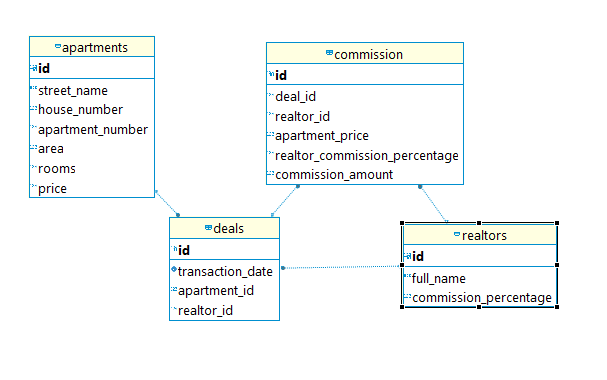


#### Запросы
5.1.	Наличие в запросе группировки Group by
Подсчет количества сделок для каждого риэлтора


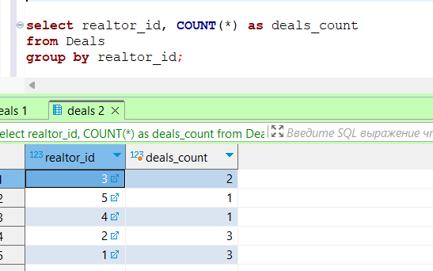

5.2.	Наличие в запросе группировки с условием Having
Подсчет количества сделок для каждого риэлтора, у которых число сделок больше 1:

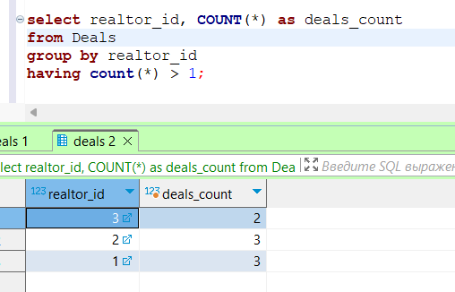
5.3.	Наличие в запросе сортировки Order by
Выборка данных о сделках с квартирами, отсортированными по дате транзакции по убыванию:

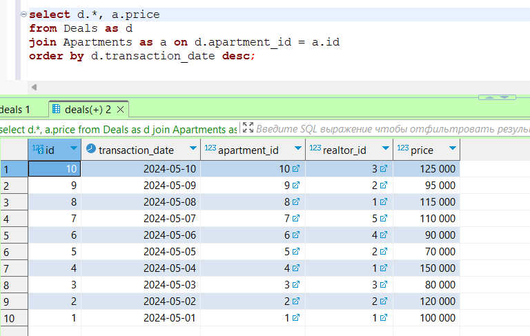
5.4.	Запрос на использование Rollup
Подсчет общей цены сделок для каждого риэлтора с использованием функции ROLLUP:

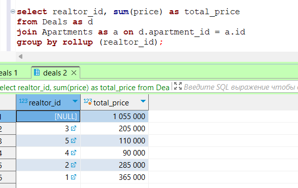
5.5.	Запрос на использование Cube
Подсчет общей цены сделок для каждого риэлтора и каждой квартиры с использованием функции CUBE:

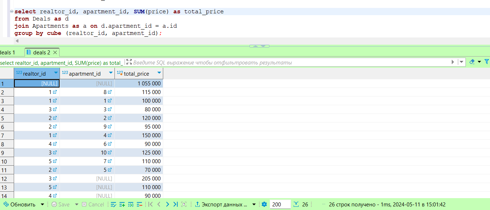
5.6.	Запрос на использование Grouping sets
Подсчет общей цены сделок для каждого риэлтора и каждой квартиры с использованием функции GROUPING SETS:

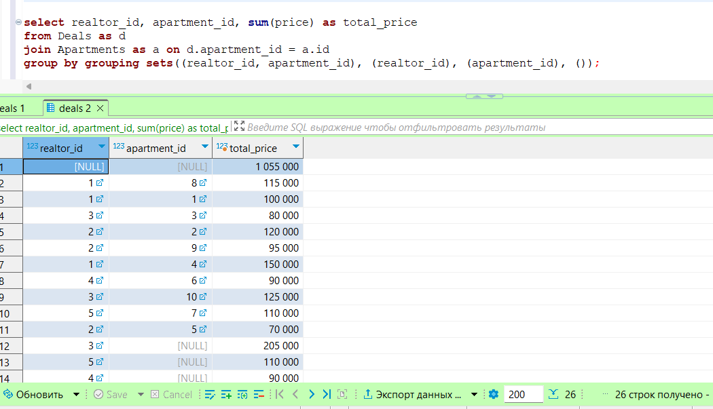
5.7.	Запрос с применением окна Over и Row_number
Добавление номера сделки (ранжирование) к данным о сделках:

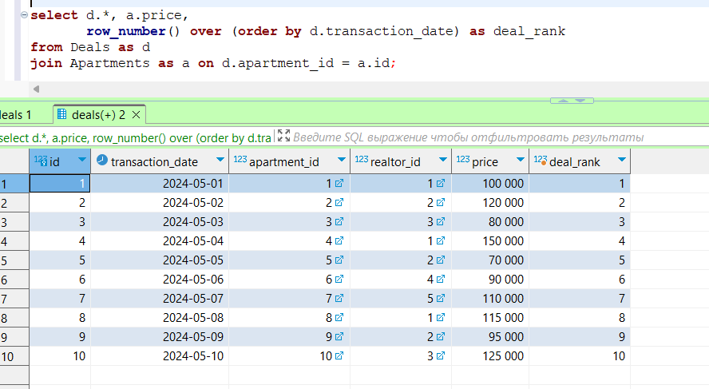

5.8.	Запрос с применением окна Over, Partition_by, Lag или Lead
Добавление даты предыдущей сделки для каждого риэлтора к данным о сделках:


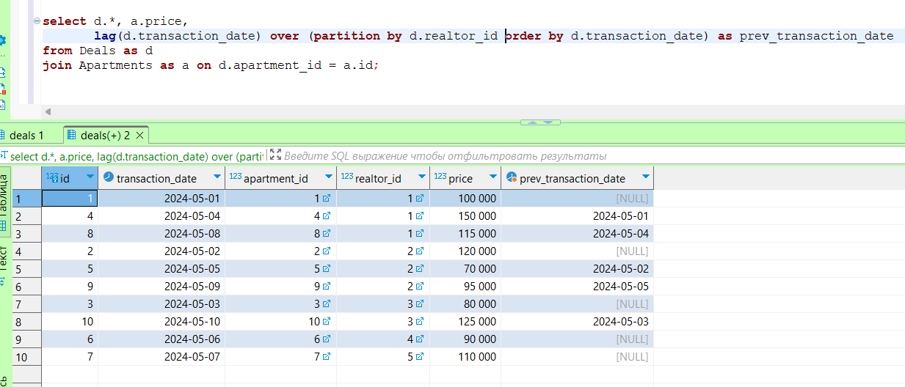

5.9.	Запрос с применением окна Over, Partition_by, Rank или Dense_rank
Добавление номера сделки (ранга) к данным о сделках с использованием функции RANK:


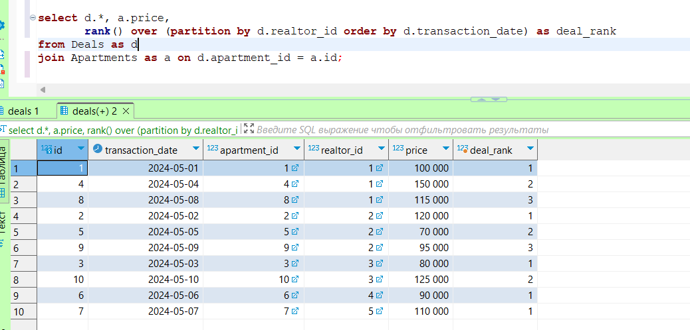
5.10.	Запрос с применением окна Over и агрегатной функции
Подсчет общей цены продаж для каждого риэлтора с использованием оконной функции:


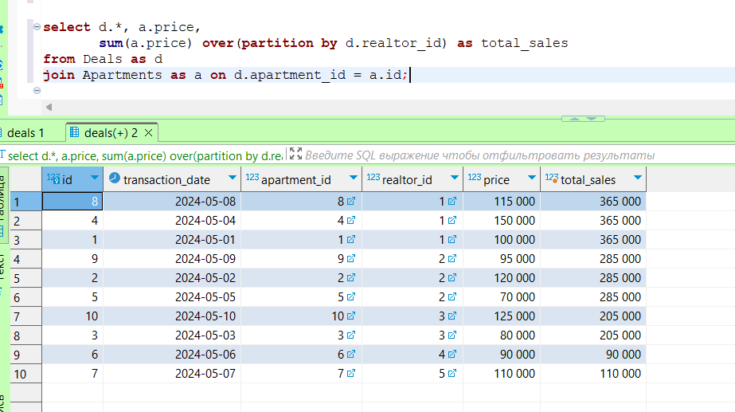


