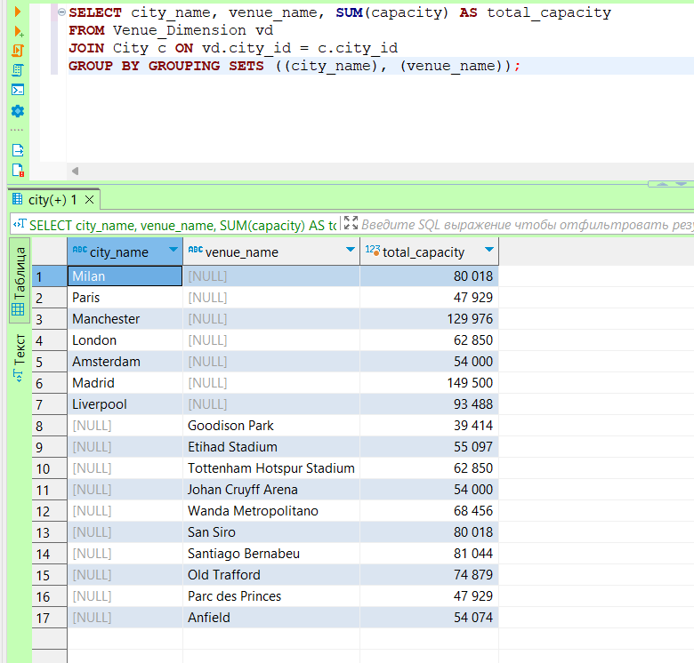

# Лаб. работа №10

### Запросы к базе Футбол (grouping sets, rollup, cube)

1 Группировка по командам и датам, с подсчетом количества игр:

2 Группировка по командам и месту проведения с подсчетом общего количества забитых голов:

3 Группировка по годам и месяцам с подсчетом количества игр:

4 Группировка по городам и стадионам с подсчетом вместимости:

5 Группировка по дням недели и датам с подсчетом количества игр:

6 Группировка по командам и подсчет общего количества игр, включая промежуточные итоги:

7 Группировка по годам и месяцам с подсчетом общего количества игр, включая промежуточные итоги:

8 Группировка по городам и стадионам с подсчетом общей вместимости, включая промежуточные итоги:

9 Группировка по датам и командам с подсчетом общего количества голов, включая промежуточные итоги:

10 Группировка по дням недели и датам с подсчетом количества игр, включая промежуточные итоги:

11 Группировка по командам и датам с подсчетом количества игр, включая все комбинации:

12 Группировка по годам и месяцам с подсчетом общего количества игр, включая все комбинации:

13 Группировка по городам и стадионам с подсчетом общей вместимости, включая все комбинации:

14 Группировка по датам и командам с подсчетом общего количества голов, включая все комбинации:

15 Группировка по дням недели и датам с подсчетом количества игр, включая все комбинации:

