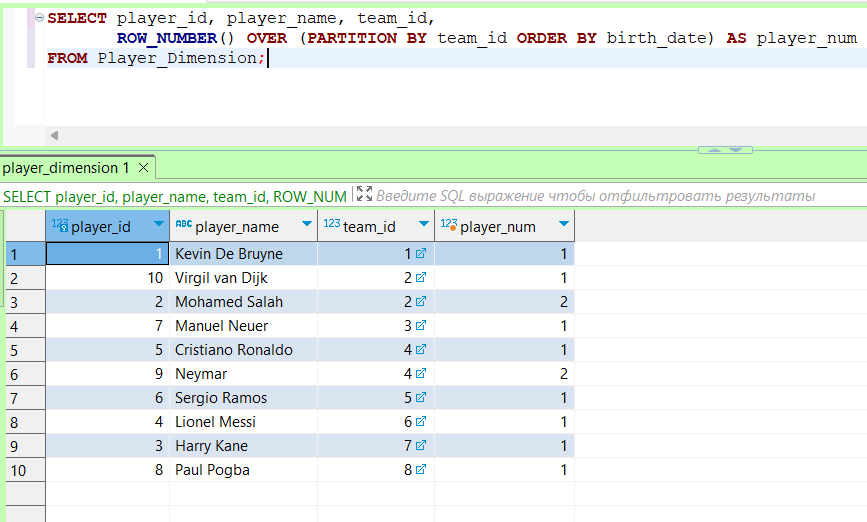

# Лабораторная работа №11

### Запросы с использованием ROW_NUMBER и ORDER BY

1 Присвоение номера каждой игре по дате:

2 Нумерация игроков по дате их рождения:

### Запросы с использованием PARTITION BY и ROW_NUMBER

3 Нумерация игр каждой команды:

4 Нумерация игроков внутри каждой команды:

### Запросы с использованием LAG

5 Предыдущий счет команды в домашней игре:

6 Предыдущий менеджер команды:

### Запросы с использованием LEAD

7 Следующий счет команды в домашней игре:

8 Следующий менеджер команды:

### Запросы с использованием RANK

9 Ранжирование команд по количеству забитых голов дома:

10 Ранжирование игроков по дате рождения внутри каждой команды:

Ранжирование городов по вместимости стадионов:

### Запросы с использованием PARTITION BY и LEAD

11 Получение следующей даты игры для каждой команды:

12 Получение следующего менеджера для каждой команды:

