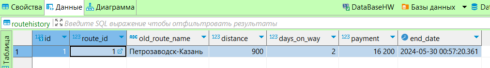
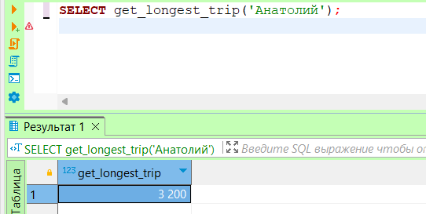
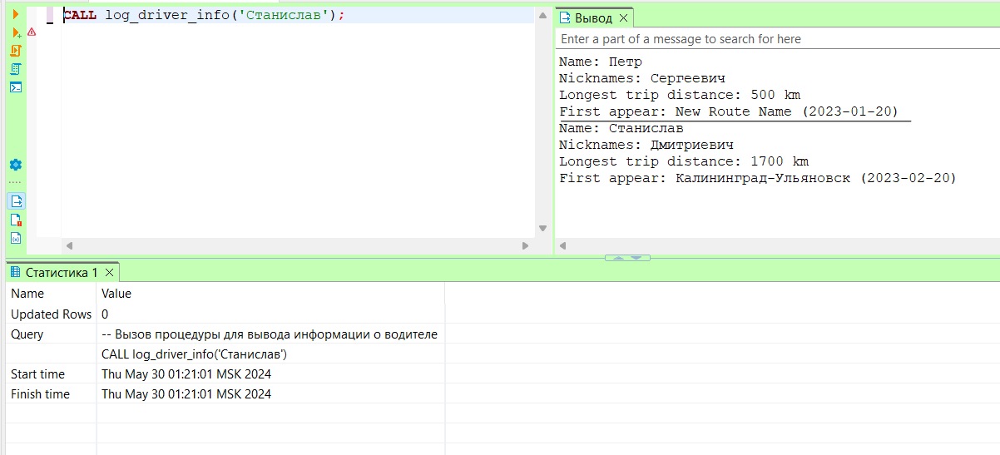

# Лабораторная работа №12


Буду использовать базу из первой лабораторной работы

### 1. Создание таблицы для истории изменений и триггера

Создадим таблицу для истории изменений route_name, триггер и соответствующую функцию.

```sql
CREATE TABLE RouteHistory (
    id SERIAL PRIMARY KEY,
    route_id INT REFERENCES Routes(id),
    old_route_name VARCHAR NOT NULL,
    distance INT NOT NULL,
    days_on_way INT,
    payment INT,
    end_date TIMESTAMP NOT NULL
);

CREATE OR REPLACE FUNCTION log_route_changes() 
RETURNS TRIGGER AS $$
BEGIN
    IF OLD.route_name IS DISTINCT FROM NEW.route_name 
        OR OLD.distance IS DISTINCT FROM NEW.distance
        OR OLD.days_on_way IS DISTINCT FROM NEW.days_on_way
    THEN
        INSERT INTO RouteHistory (route_id, old_route_name, distance, days_on_way, payment, end_date)
        VALUES (OLD.id, OLD.route_name, OLD.distance, OLD.days_on_way, OLD.payment, NOW());
    END IF;
    RETURN NEW;
END;
$$ LANGUAGE plpgsql;

CREATE TRIGGER trg_log_route_changes
AFTER UPDATE ON Routes
FOR EACH ROW
WHEN (OLD.route_name IS DISTINCT FROM NEW.route_name 
    OR OLD.distance IS DISTINCT FROM NEW.distance
    OR OLD.days_on_way IS DISTINCT FROM NEW.days_on_way)
EXECUTE FUNCTION log_route_changes();

```

Создадим запрос, который показывает значения для конкретного кортежа на заданный момент времени:

```sql
CREATE OR REPLACE FUNCTION get_route_at_time(route_id INT, check_time TIMESTAMP)
RETURNS TABLE(route_name VARCHAR, distance INT, days_on_way INT, payment INT) AS $$
BEGIN
    RETURN QUERY
    SELECT old_route_name, distance, days_on_way, payment
    FROM RouteHistory
    WHERE route_id = route_id AND end_date <= check_time
    ORDER BY end_date DESC
    LIMIT 1;
END;
$$ LANGUAGE plpgsql;
```

### 2. Функция для вычисления самой длительной поездки водителя

```sql
CREATE OR REPLACE FUNCTION get_longest_trip(driver_name VARCHAR)
RETURNS INT AS $$
DECLARE
    longest_trip INT;
BEGIN
    SELECT MAX(distance)
    INTO longest_trip
    FROM Work_done wd
    JOIN Drivers d ON wd.driver_id = d.id
    JOIN Routes r ON wd.route_id = r.id
    WHERE d.first_name = driver_name;

    IF longest_trip IS NULL THEN
        RETURN 0;
    END IF;

    RETURN longest_trip;
END;
$$ LANGUAGE plpgsql;
```

### 3. Процедура для вывода информации о водителе

Создадим процедуру, которая по имени водителя выводит в лог информацию о нем.

```sql
CREATE OR REPLACE PROCEDURE log_driver_info(driver_name VARCHAR)
LANGUAGE plpgsql
AS $$
DECLARE
    driver_id INT;
    longest_trip INT;
    nicknames TEXT;
    first_appear TEXT;
    first_appear_year INT;
BEGIN
    SELECT id
    INTO driver_id
    FROM Drivers
    WHERE first_name = driver_name;

    IF driver_id IS NULL THEN
        RAISE EXCEPTION 'Invalid data';
    END IF;

    longest_trip := get_longest_trip(driver_name);

    SELECT STRING_AGG(patronymic, ', ')
    INTO nicknames
    FROM Drivers
    WHERE first_name = driver_name;

    SELECT r.route_name || ' (' || wd.departure_date || ')'
    INTO first_appear
    FROM Routes r
    JOIN Work_done wd ON r.id = wd.route_id
    JOIN Drivers d ON wd.driver_id = d.id
    WHERE d.first_name = driver_name
    ORDER BY wd.departure_date
    LIMIT 1;

    IF first_appear IS NULL THEN
        RAISE EXCEPTION 'Invalid data';
    END IF;

    RAISE NOTICE 'Name: %', driver_name;
    IF nicknames IS NOT NULL THEN
        RAISE NOTICE 'Nicknames: %', nicknames;
    END IF;
    RAISE NOTICE 'Longest trip distance: % km', longest_trip;
    RAISE NOTICE 'First appear: %', first_appear;
END;
$$;
```


### Проверка 

#### 1
```sql
UPDATE Routes
SET route_name = 'New Route Name', distance = 500
WHERE id = 1;
```
Обновил значение в таблице Routes <br>
Строка добавилась в таблицу routehistory



#### 2 
 Получение самой длительной поездки водителя по имени



#### 3 
Вызов процедуры для вывода информации о водителе




