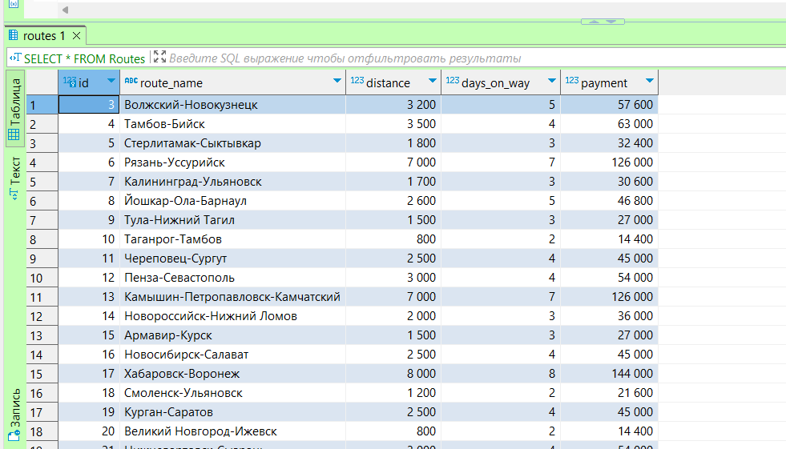
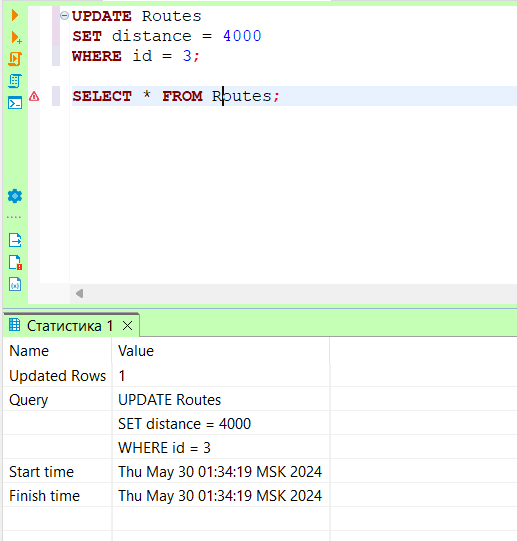
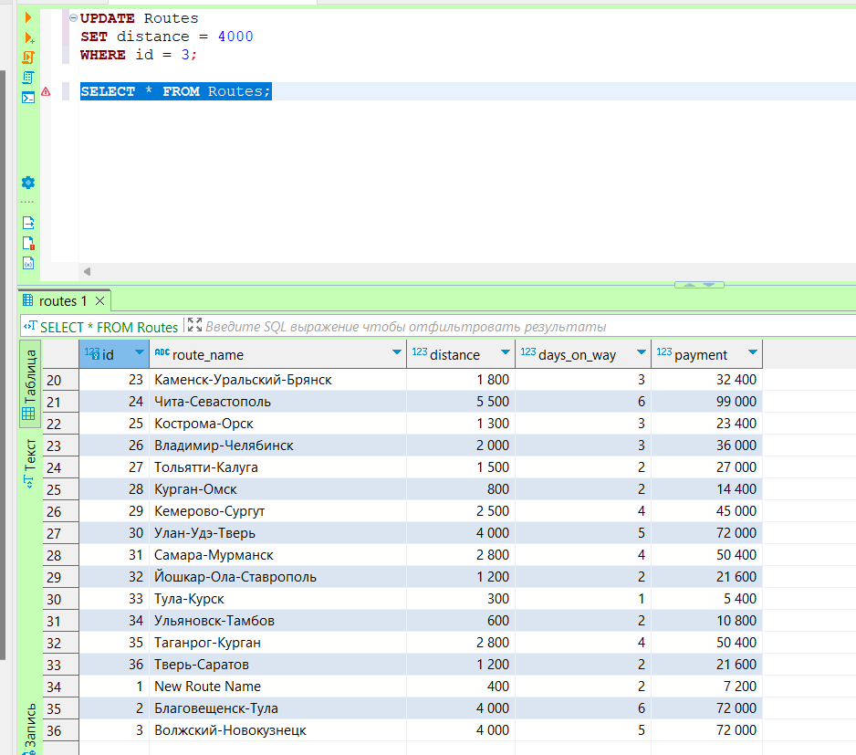
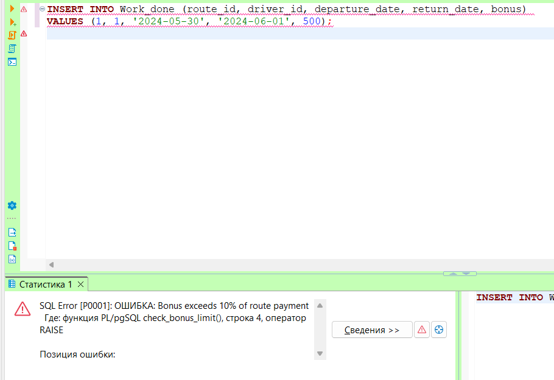
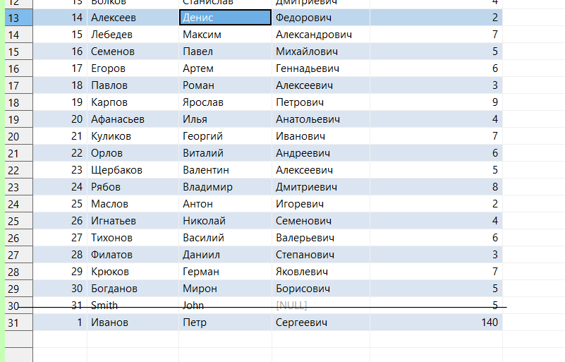

# Лабораторная работа №13

### Создание триггеров

```sql
CREATE OR REPLACE FUNCTION update_payment_trigger()
RETURNS TRIGGER AS $$
BEGIN
    NEW.payment := NEW.distance * 18;
    RETURN NEW;
END;
$$ LANGUAGE plpgsql;

CREATE TRIGGER trg_update_payment
BEFORE UPDATE ON Routes
FOR EACH ROW
WHEN (OLD.distance IS DISTINCT FROM NEW.distance)
EXECUTE FUNCTION update_payment_trigger();
```

### Проверка работы триггера

Было 




Стало 



### Изменение триггера

Mы хотим изменить триггер так, чтобы он также обновлял значение payment при изменении поля days_on_way.
```sql
DROP TRIGGER IF EXISTS trg_update_payment ON Routes;

CREATE TRIGGER trg_update_payment
BEFORE UPDATE ON Routes
FOR EACH ROW
WHEN (OLD.distance IS DISTINCT FROM NEW.distance OR OLD.days_on_way IS DISTINCT FROM NEW.days_on_way)
EXECUTE FUNCTION update_payment_trigger();
```

### Удаление триггера
```sql
DROP TRIGGER IF EXISTS trg_update_payment ON Routes;
```


### Триггер для проверки ограничения на сумму бонуса:


```sql
CREATE OR REPLACE FUNCTION check_bonus_constraint()
RETURNS TRIGGER AS $$
BEGIN
    IF NEW.bonus > 1000 THEN
        RAISE EXCEPTION 'Bonus cannot exceed 1000';
    END IF;
    RETURN NEW;
END;
$$ LANGUAGE plpgsql;

CREATE TRIGGER enforce_bonus_constraint
BEFORE INSERT OR UPDATE ON Work_done
FOR EACH ROW
EXECUTE FUNCTION check_bonus_constraint();

```
### Проверка работы триггера




### Удалил 
```sql
DROP TRIGGER IF EXISTS enforce_bonus_constraint ON Work_done;
```


### Триггер для автоматического обновления опыта водителя при добавлении новой записи в таблицу маршрутов:


```sql
CREATE OR REPLACE FUNCTION update_driver_experience()
RETURNS TRIGGER AS $$
DECLARE
    total_days_on_way INT;
BEGIN
    SELECT SUM(days_on_way) INTO total_days_on_way FROM Routes;
    UPDATE Drivers SET driving_experience = driving_experience + total_days_on_way WHERE id = NEW.driver_id;
    RETURN NEW;
END;
$$ LANGUAGE plpgsql;

CREATE TRIGGER auto_update_driver_experience
AFTER INSERT ON Work_done
FOR EACH ROW
EXECUTE FUNCTION update_driver_experience();
```

### Проверил
```sql
INSERT INTO Work_done (route_id, driver_id, departure_date, return_date, bonus)
VALUES (1, 1, '2024-05-30', '2024-06-01', 100);
```



### Удалил 

```sql 
DROP TRIGGER IF EXISTS auto_update_driver_experience ON Work_done;
```

