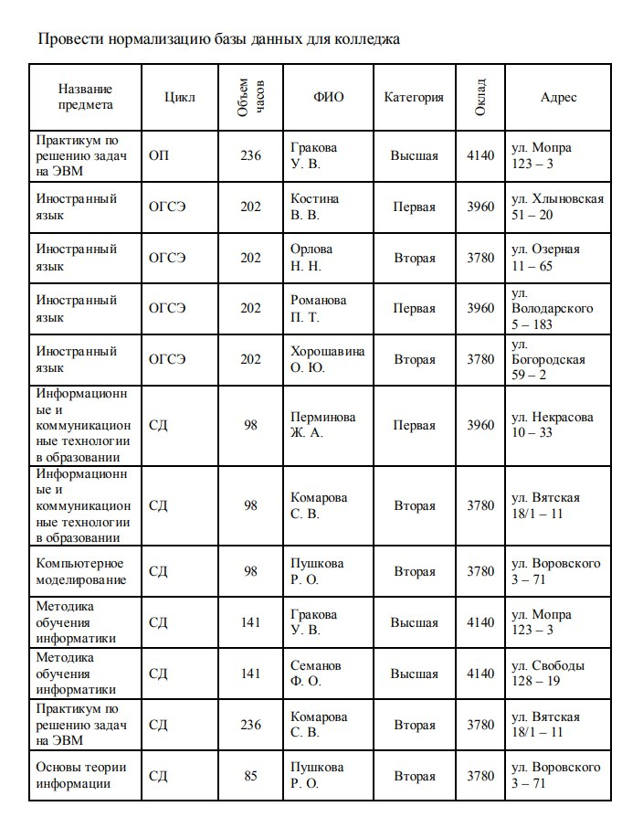
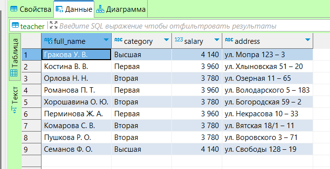
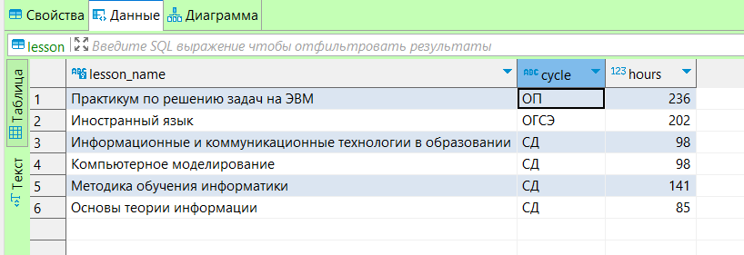
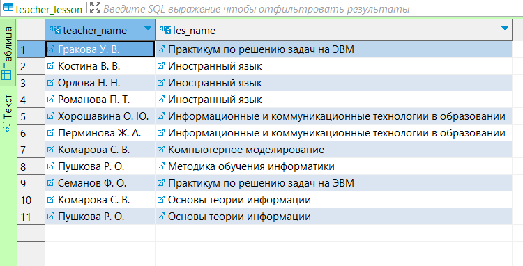

<<<<<<< HEAD
# База данных: Колледж 

## Исходная база данных


Эта таблица уже в первой нормальной форме, так как все данные атомарны, нет массивов и повторяющихся групп данных.<br/>
Разбил исходную таблицу на таблицу с преподаватели и на таблицу с предметами (создание таблиц и их парсинг в самом конце), тем самым получил таблицы удовлетворяющие требованиям 3НФ(Каждый столбец, не являющийся ключом, зависит только от первичного ключа, и не существует транзитивных зависимостей). 

## Этап 1. Функциональные зависимости

Таблица "teacher" (Преподаватели)
ФИО -> Категория, Оклад, Адрес
Практический смысл: ФИО преподавателя однозначно определяет категорию, оклад и адрес.

Таблица "lesson" (Предметы)
Название предмета -> Цикл, Объем часов
Практический смысл: Название предмета однозначно определяет цикл и объем часов.

Таблица "teacher_lesson" (Преподаватели_Предметы)
ФИО преподавателя, Название предмета -> (Ничего)
Практический смысл: Связь между преподавателями и предметами.

<br/>

## Этап 2. Нормализация отношений: 
Таблица "teacher" (Преподаватели)<br/>
Первичный ключ: ФИО<br/>
Нормализация: Уже находится в 1НФ, 2НФ, и 3НФ, так как у нас нет составных атрибутов.<br/><br/>
Таблица "lesson" (Предметы)<br/>
Первичный ключ: Название предмета<br/>
Нормализация: Уже находится в 1НФ, 2НФ и 3НФ.<br/><br/>
Таблица "teacher_lesson" (Преподаватели_Предметы)<br/>
Первичный ключ: (ФИО преподавателя, Название предмета)<br/>
Нормализация: Уже находится в 1НФ, 2НФ и 3НФ.
 

## Этап 3. Проверка смысла ссылок: 
Ссылки между таблицами имеют смысл, так как "Преподаватели_Предметы" связывает преподавателей с предметами.


 
 ## Создание Таблиц 
```sql
create table teacher (
    full_name varchar(255) primary key,
    category varchar(255),
    salary int,
    address varchar(255)
);
create table lesson (
    lesson_name varchar(255) primary key,
    cycle varchar(255),
    hours int
);

create table teacher_lesson (
    teacher_name varchar(255),
    les_name varchar(255),
    primary key (teacher_name, les_name),
    foreign key (teacher_name) references teacher(full_name),
    foreign key (les_name) references lesson(lesson_name)
);
```


```sql

insert into teacher (full_name, category, salary, address)
values 
    ('Гракова У. В.', 'Высшая', 4140, 'ул. Мопра 123 – 3'),
    ('Костина В. В.', 'Первая', 3960, 'ул. Хлыновская 51 – 20'),
    ('Орлова Н. Н.', 'Вторая', 3780, 'ул. Озерная 11 – 65'),
    ('Романова П. Т.', 'Первая', 3960, 'ул. Володарского 5 – 183'),
    ('Хорошавина О. Ю.', 'Вторая', 3780, 'ул. Богородская 59 – 2'),
    ('Перминова Ж. А.', 'Первая', 3960, 'ул. Некрасова 10 – 33'),
    ('Комарова С. В.', 'Вторая', 3780, 'ул. Вятская 18/1 – 11'),
    ('Пушкова Р. О.', 'Вторая', 3780, 'ул. Воровского 3 – 71'),
    ('Семанов Ф. О.', 'Высшая', 4140, 'ул. Свободы 128 – 19');

insert into lesson (lesson_name, cycle, hours)
values 
    ('Практикум по решению задач на ЭВМ', 'ОП', 236),
    ('Иностранный язык', 'ОГСЭ', 202),
    ('Информационные и коммуникационные технологии в образовании', 'СД', 98),
    ('Компьютерное моделирование', 'СД', 98),
    ('Методика обучения информатики', 'СД', 141),
    ('Основы теории информации', 'СД', 85);

insert into teacher_lesson (teacher_name, les_name)
values 
    ('Гракова У. В.', 'Практикум по решению задач на ЭВМ'),
    ('Костина В. В.', 'Иностранный язык'),
    ('Орлова Н. Н.', 'Иностранный язык'),
    ('Романова П. Т.', 'Иностранный язык'),
    ('Хорошавина О. Ю.', 'Информационные и коммуникационные технологии в образовании'),
    ('Перминова Ж. А.', 'Информационные и коммуникационные технологии в образовании'),
    ('Комарова С. В.', 'Компьютерное моделирование'),
    ('Пушкова Р. О.', 'Методика обучения информатики'),
    ('Семанов Ф. О.', 'Практикум по решению задач на ЭВМ'),
    ('Комарова С. В.', 'Основы теории информации'),
    ('Пушкова Р. О.', 'Основы теории информации');

```

### Таблица Преподаватели


### Таблица Предметы


### Таблица Преподаватели_Предметы



=======
# База данных: Колледж 

## Исходная база данных


Эта таблица уже в первой нормальной форме, так как все данные атомарны, нет массивов и повторяющихся групп данных.<br/>
Разбил исходную таблицу на таблицу с преподаватели и на таблицу с предметами (создание таблиц и их парсинг в самом конце), тем самым получил таблицы удовлетворяющие требованиям 3НФ(Каждый столбец, не являющийся ключом, зависит только от первичного ключа, и не существует транзитивных зависимостей). 

## Этап 1. Функциональные зависимости

Таблица "teacher" (Преподаватели)
ФИО -> Категория, Оклад, Адрес
Практический смысл: ФИО преподавателя однозначно определяет категорию, оклад и адрес.

Таблица "lesson" (Предметы)
Название предмета -> Цикл, Объем часов
Практический смысл: Название предмета однозначно определяет цикл и объем часов.

Таблица "teacher_lesson" (Преподаватели_Предметы)
ФИО преподавателя, Название предмета -> (Ничего)
Практический смысл: Связь между преподавателями и предметами.

<br/>

## Этап 2. Нормализация отношений: 
Таблица "teacher" (Преподаватели)<br/>
Первичный ключ: ФИО<br/>
Нормализация: Уже находится в 1НФ, 2НФ, и 3НФ, так как у нас нет составных атрибутов.<br/><br/>
Таблица "lesson" (Предметы)<br/>
Первичный ключ: Название предмета<br/>
Нормализация: Уже находится в 1НФ, 2НФ и 3НФ.<br/><br/>
Таблица "teacher_lesson" (Преподаватели_Предметы)<br/>
Первичный ключ: (ФИО преподавателя, Название предмета)<br/>
Нормализация: Уже находится в 1НФ, 2НФ и 3НФ.
 

## Этап 3. Проверка смысла ссылок: 
Ссылки между таблицами имеют смысл, так как "Преподаватели_Предметы" связывает преподавателей с предметами.


 
 ## Создание Таблиц 
```sql
create table teacher (
    full_name varchar(255) primary key,
    category varchar(255),
    salary int,
    address varchar(255)
);
create table lesson (
    lesson_name varchar(255) primary key,
    cycle varchar(255),
    hours int
);

create table teacher_lesson (
    teacher_name varchar(255),
    les_name varchar(255),
    primary key (teacher_name, les_name),
    foreign key (teacher_name) references teacher(full_name),
    foreign key (les_name) references lesson(lesson_name)
);
```


```sql

insert into teacher (full_name, category, salary, address)
values 
    ('Гракова У. В.', 'Высшая', 4140, 'ул. Мопра 123 – 3'),
    ('Костина В. В.', 'Первая', 3960, 'ул. Хлыновская 51 – 20'),
    ('Орлова Н. Н.', 'Вторая', 3780, 'ул. Озерная 11 – 65'),
    ('Романова П. Т.', 'Первая', 3960, 'ул. Володарского 5 – 183'),
    ('Хорошавина О. Ю.', 'Вторая', 3780, 'ул. Богородская 59 – 2'),
    ('Перминова Ж. А.', 'Первая', 3960, 'ул. Некрасова 10 – 33'),
    ('Комарова С. В.', 'Вторая', 3780, 'ул. Вятская 18/1 – 11'),
    ('Пушкова Р. О.', 'Вторая', 3780, 'ул. Воровского 3 – 71'),
    ('Семанов Ф. О.', 'Высшая', 4140, 'ул. Свободы 128 – 19');

insert into lesson (lesson_name, cycle, hours)
values 
    ('Практикум по решению задач на ЭВМ', 'ОП', 236),
    ('Иностранный язык', 'ОГСЭ', 202),
    ('Информационные и коммуникационные технологии в образовании', 'СД', 98),
    ('Компьютерное моделирование', 'СД', 98),
    ('Методика обучения информатики', 'СД', 141),
    ('Основы теории информации', 'СД', 85);

insert into teacher_lesson (teacher_name, les_name)
values 
    ('Гракова У. В.', 'Практикум по решению задач на ЭВМ'),
    ('Костина В. В.', 'Иностранный язык'),
    ('Орлова Н. Н.', 'Иностранный язык'),
    ('Романова П. Т.', 'Иностранный язык'),
    ('Хорошавина О. Ю.', 'Информационные и коммуникационные технологии в образовании'),
    ('Перминова Ж. А.', 'Информационные и коммуникационные технологии в образовании'),
    ('Комарова С. В.', 'Компьютерное моделирование'),
    ('Пушкова Р. О.', 'Методика обучения информатики'),
    ('Семанов Ф. О.', 'Практикум по решению задач на ЭВМ'),
    ('Комарова С. В.', 'Основы теории информации'),
    ('Пушкова Р. О.', 'Основы теории информации');

```

### Таблица Преподаватели


### Таблица Предметы


### Таблица Преподаватели_Предметы


>>>>>>> bc7afa58035cc793570c5a3a6d9e447100d0d9a2
