# Лабораторная работа #3

## Шаг 1: Бенчмаркинг сценариев работы с базой данных 
 
###  Запись сценариев работы в файлы 
 
Для каждого сценария работы с базой данных были разработаны соответствующие SQL-запросы и сохранены в отдельные файлы (scenario_1.sql, scenario_2.sql, scenario_3.sql). 

## Шаг 2: Выполнение бенчмаркинга

для каждого файла(scenario_1.sql, scenario_2.sql, scenario_3.sql) был проведен бенчмарк
### Первый файл

<br>

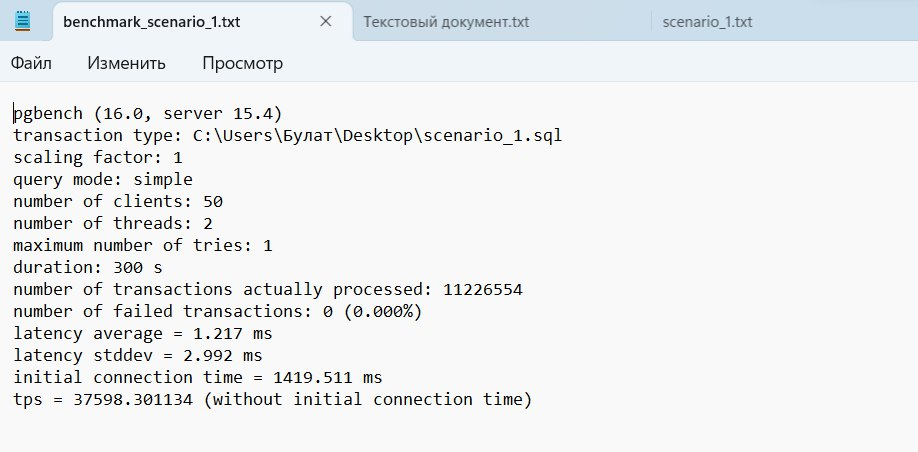


### Второй файл
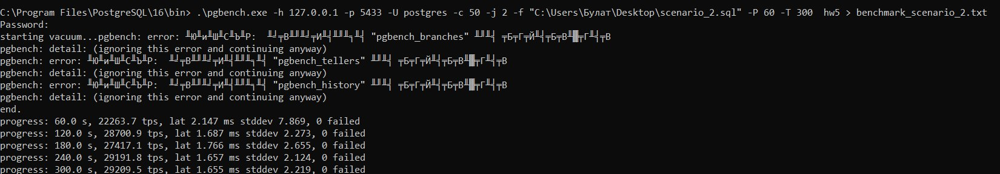

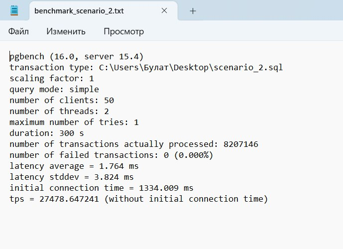

### Третий файл

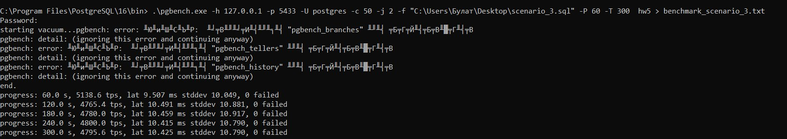

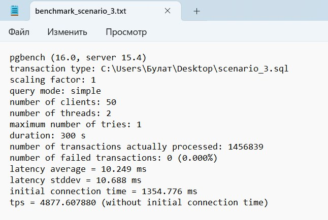


## Шаг 3:Настройка индексирования и бенчмаркинг 

Для каждого сценария был создан B-tree индекс на определенном столбце

### Обычный B-tree индекс

Для каждого сценария был создан Обычный B-tree индекс


``` sql
create index idx_driver on drivers(driving_experience)
```
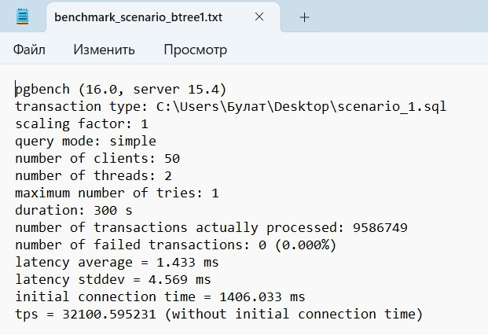

``` sql
create index idx_driver on routes(distance)
```
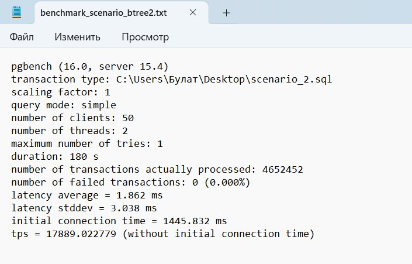

``` sql
create index idx_driver on drivers(first_name)
```
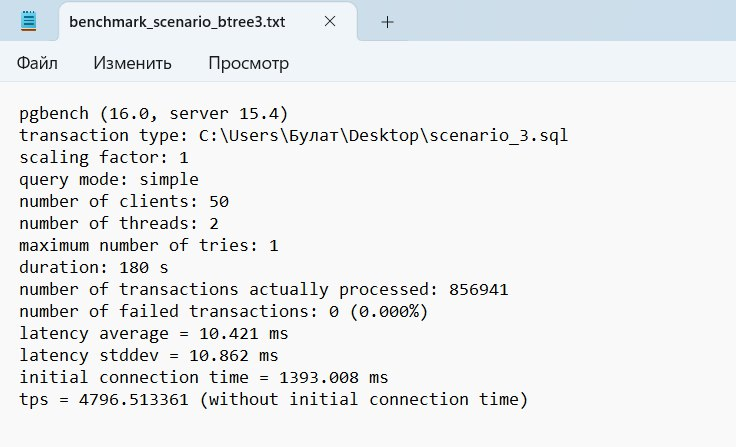

### Функциональный индекс

Для каждого сценария был создан Функциональный B-tree индекс


```sql
create index idx_driver on drivers(avg(driving_experience))
```

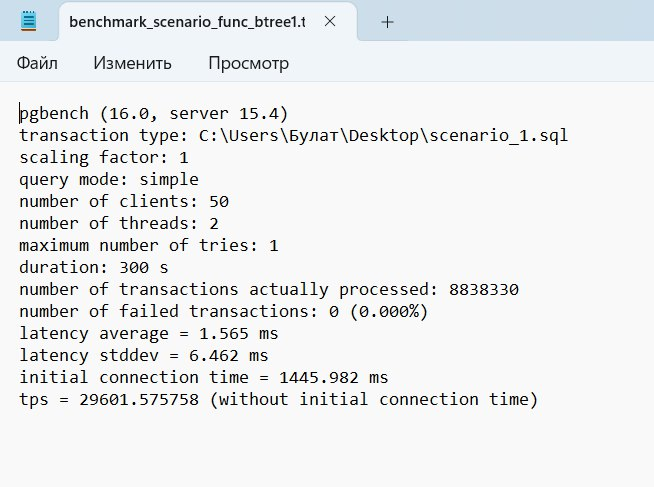

```sql
create index idx_route on routes(lower(route_name));
```

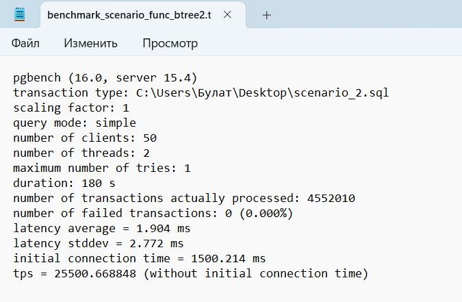


```sql
create index idx_drivers on drivers(upper(first_name))
```

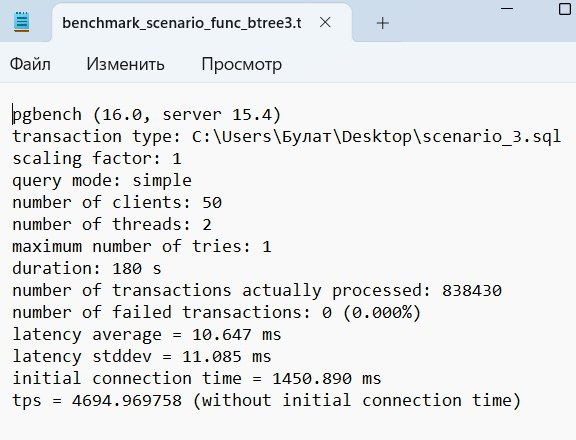


### Условный индекс

Для каждого сценария был создан Условный B-tree индекс


```sql
create index idx_drivers on drivers(first_name)
where first_name is not null
```

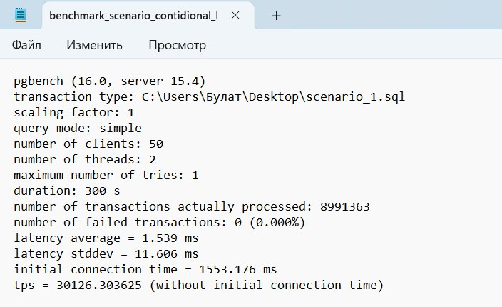

```sql
create index idx_route on routes(distance) 
where distance > 1000
```

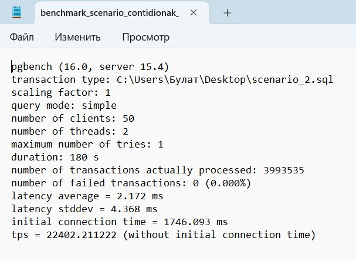


```sql
create index idx_driver on drivers(driving_experience)
where driving_experience > 3
```

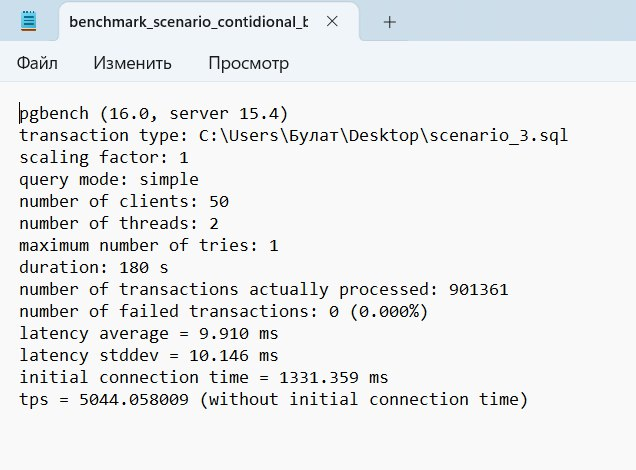


### Включённый индекс

Для каждого сценария был создан включённый B-tree индекс


```sql
create index idx_driver on drivers(driving_experience)
include (last_name);
```

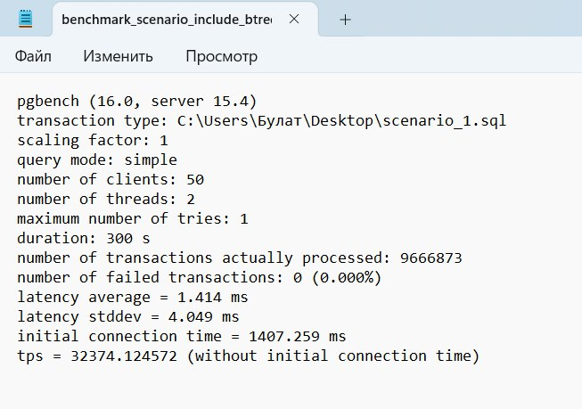

```sql
create index idx_route on routes(distance) include (route_name)
where distance > 1000
```

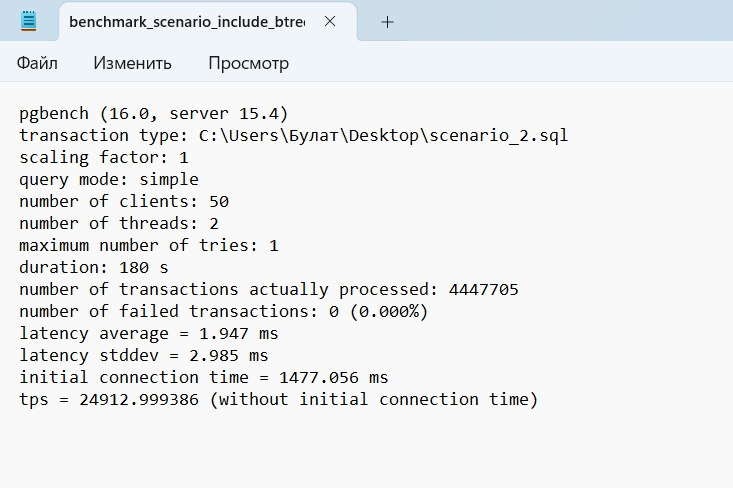


```sql
create index idx_driver on drivers(driving_experience)
include (last_name);
```

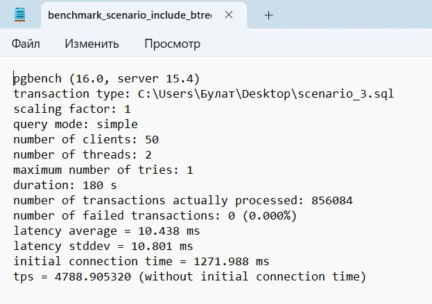


### После каждого бенчмаркинга индекс удалялся. 


## Шаг 4: Вывод

После анализа и проведения экспериментов можно сделать вывод о том, что использование индексов действительно приносит выигрыш в производительности запросов к базе данных. Однако максимальный выигрыш от использования индексов наблюдается при создании уникальных индексов на полях, которые часто используются в условиях запросов или соединениях таблиц(лучше всего индексы показали себя с операцией select, хуже всего с update, insert работает немного медленее чем select).

Причина максимального выигрыша от уникальных индексов заключается в том, что они позволяют базе данных быстро находить и сравнивать значения по этим полям, что ускоряет выполнение запросов и уменьшает нагрузку на сервер.

Таким образом, создание уникальных индексов на часто используемых полях является эффективным способом оптимизации запросов к базе данных и повышения производительности системы в целом.


(Все скрины бенчмаркинга и sql запросы хранятся в папке images)


