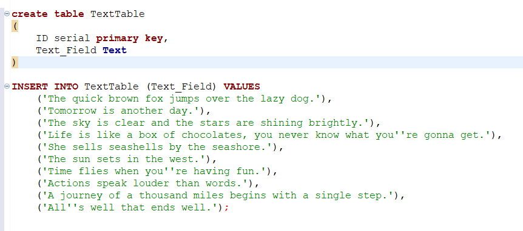
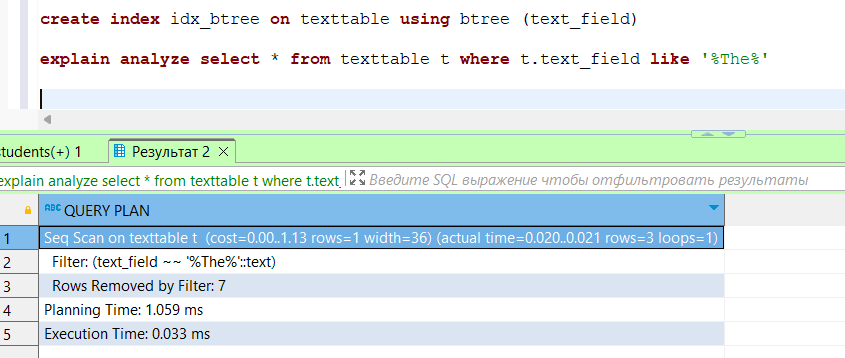
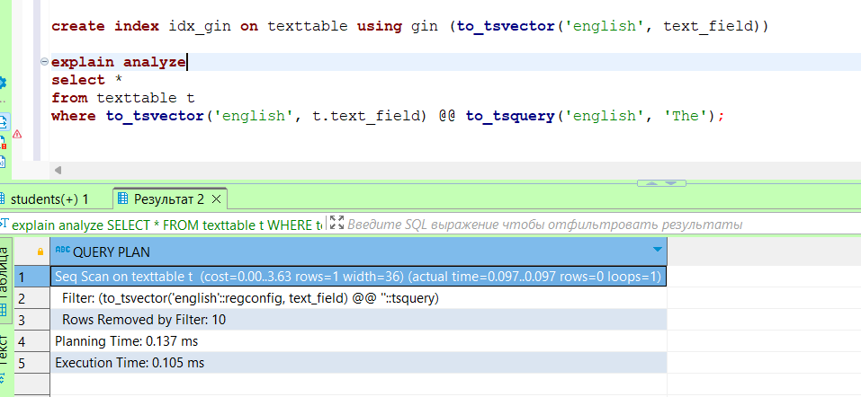
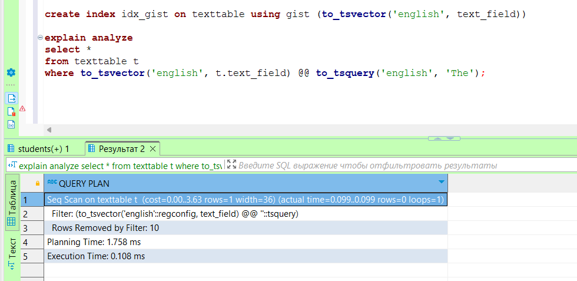
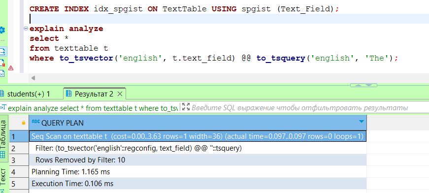

## Лабораторная работа №5

Создал доп таблицу 

Создавал индекс и сразу фиксировал результат
1.	B-Tree индекс:

2.	GIN (Generalized Inverted Index) индекс для полнотекстового поиска:

3.	GiST (Generalized Search Tree) индекс для полнотекстового поиска:

4.	SP-GiST (Space-Partitioned Generalized Search Tree) индекс для полнотекстового поиска:

на моем примере лучше всех отработал gin 