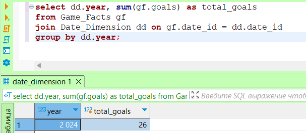
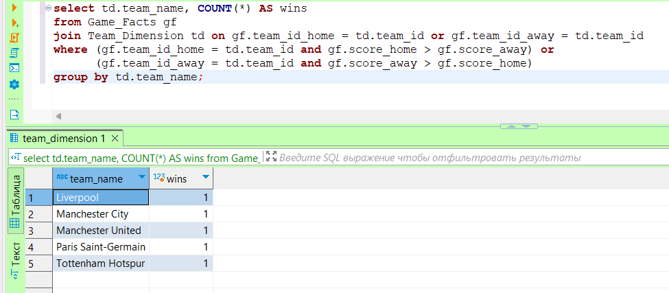
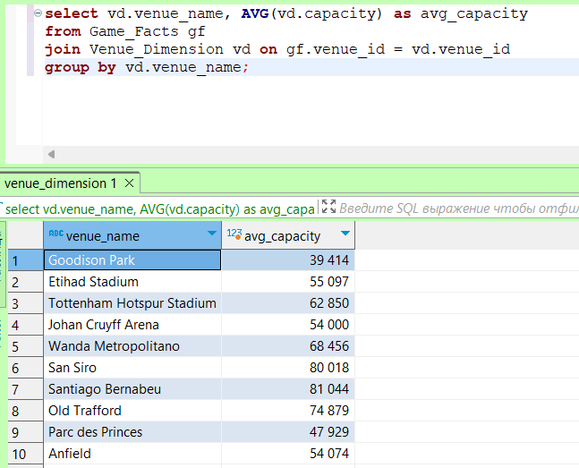
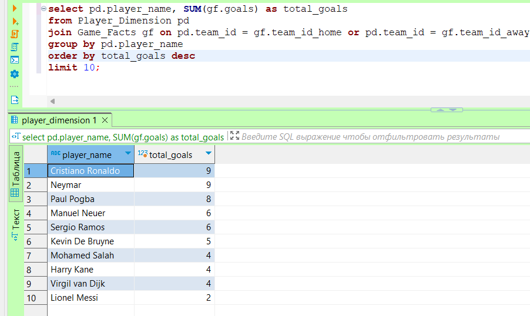
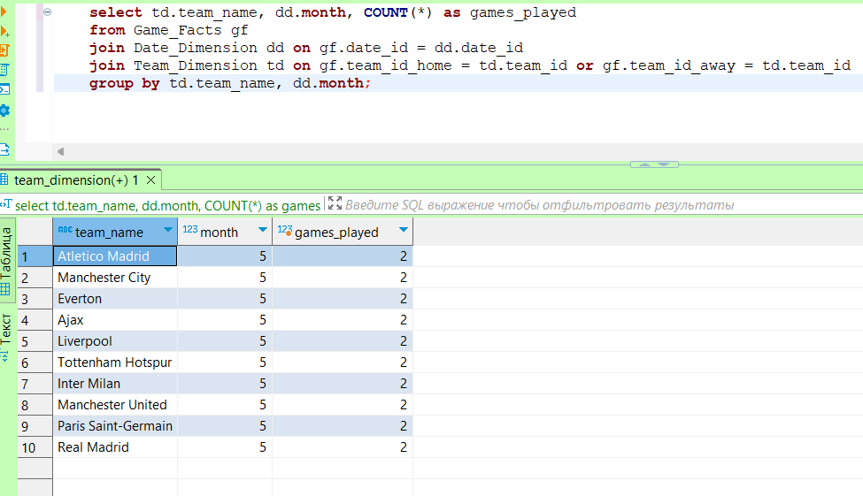

# Лабораторная работа №8

## Проектирование БД в многомерной модели представления данных (Тема: Футбол)
### Шаг 1: Проектирование модели звезды
### Основные сущности:
#### Факт игры (Game Facts):

game_id (ID игры)<br>
date_id (ID даты)<br>
team_id_home (ID домашней команды)<br>
team_id_away (ID гостевой команды)<br>
score_home (Счет домашней команды)<br>
score_away (Счет гостевой команды)<br>
venue_id (ID места проведения)<br>
goals (Общее количество голов)<br>

#### Измерение Дата (Date Dimension):

date_id (ID даты)<br>
date (Дата)<br>
day (День)<br>
month (Месяц)<br>
year (Год)<br>
weekday (День недели)<br>

#### Измерение Команда (Team Dimension):

team_id (ID команды)<br>
team_name (Название команды)<br>
manager (Тренер команды)<br>
stadium (Стадион команды)<br>
founded_year (Год основания)<br>
#### Измерение Место проведения (Venue Dimension):

venue_id (ID места проведения)<br>
venue_name (Название места)<br>
city (Город)<br>
capacity (Вместимость)<br>
#### Измерение Игрок (Player Dimension):

player_id (ID игрока)<br>
player_name (Имя игрока)<br>
team_id (ID команды)<br>
position (Позиция)<br>
nationality (Национальность)<br>
birth_date (Дата рождения)<br>

### Шаг 2: Переход от модели звезды к модели снежинки

### Нормализация измерений:
#### Измерение Дата (Date Dimension):

Дата уже достаточно нормализована.<br>
#### Измерение Команда (Team Dimension):

Выделим тренеров в отдельную таблицу:
manager_id (ID тренера)<br>
manager_name (Имя тренера)<br>
#### Измерение Место проведения (Venue Dimension):

Можно выделить города в отдельную таблицу:
city_id (ID города)<br>
city_name (Название города)<br>
#### Измерение Игрок (Player Dimension):

Выделим позиции и национальности в отдельные таблицы:
position_id (ID позиции)<br>
position_name (Название позиции)<br>
nationality_id (ID национальности)<br>
nationality_name (Название национальности)<br>
### Шаг 3: Реализация спроектированной базы в СУБД

```sql
-- Факт игры
create table Game_Facts (
    game_id serial primary key,
    date_id int,
    team_id_home int,
    team_id_away int,
    score_home int,
    score_away int,
    venue_id int,
    goals int,
    foreign key (date_id) references Date_Dimension(date_id),
    foreign key (team_id_home) references Team_Dimension(team_id),
    foreign key (team_id_away) references Team_Dimension(team_id),
    foreign key (venue_id) references Venue_Dimension(venue_id)
);
-- Измерение Дата
create table Date_Dimension (
    date_id serial primary key,
    date date,
    day int,
    month int,
    year int,
    weekday varchar(10)
);
-- Измерение Команда
create table Team_Dimension (
    team_id serial primary key,
    team_name varchar(100),
    manager_id int,
    stadium varchar(100),
    founded_year int,
    foreign key (manager_id) references Manager(manager_id)
);

create table Manager (
    manager_id serial primary key,
    manager_name varchar(100)
);

-- Измерение Место проведения
create table Venue_Dimension (
    venue_id serial primary key,
    venue_name varchar(100),
    city_id int,
    capacity int,
    foreign key (city_id) references City(city_id)
);

create table City (
    city_id serial primary key,
    city_name varchar(100)
);

-- Измерение Игрок
create table Player_Dimension (
    player_id serial primary key,
    player_name varchar(100),
    team_id int,
    position_id int,
    nationality_id int,
    birth_date date,
    foreign key (team_id) references Team_Dimension(team_id),
    foreign key (position_id) references Position(position_id),
    foreign key (nationality_id) references Nationality(nationality_id)
);

create table Position (
    position_id serial primary key,
    position_name varchar(50)
);

create table Nationality (
    nationality_id serial primary key,
    nationality_name varchar(50)
);

```

#### Данные 

``` sql 
insert into Date_Dimension (date, day, month, year, weekday) values 
('2024-05-01', 1, 5, 2024, 'Wednesday'),
('2024-05-02', 2, 5, 2024, 'Thursday'),
('2024-05-03', 3, 5, 2024, 'Friday'),
('2024-05-04', 4, 5, 2024, 'Saturday'),
('2024-05-05', 5, 5, 2024, 'Sunday'),
('2024-05-06', 6, 5, 2024, 'Monday'),
('2024-05-07', 7, 5, 2024, 'Tuesday'),
('2024-05-08', 8, 5, 2024, 'Wednesday'),
('2024-05-09', 9, 5, 2024, 'Thursday'),
('2024-05-10', 10, 5, 2024, 'Friday');

insert into Manager (manager_name) values 
('Pep Guardiola'),
('Jurgen Klopp'),
('Alex Ferguson'),
('Zinedine Zidane'),
('Diego Simeone'),
('Antonio Conte'),
('Mauricio Pochettino'),
('Carlo Ancelotti'),
('Thomas Tuchel'),
('Erik ten Hag');

insert into Team_Dimension (team_name, manager_id, stadium, founded_year) values 
('Manchester City', 1, 'Etihad Stadium', 1880),
('Liverpool', 2, 'Anfield', 1892),
('Manchester United', 3, 'Old Trafford', 1878),
('Real Madrid', 4, 'Santiago Bernabeu', 1902),
('Atletico Madrid', 5, 'Wanda Metropolitano', 1903),
('Inter Milan', 6, 'San Siro', 1908),
('Tottenham Hotspur', 7, 'Tottenham Hotspur Stadium', 1882),
('Everton', 8, 'Goodison Park', 1878),
('Paris Saint-Germain', 9, 'Parc des Princes', 1970),
('Ajax', 10, 'Johan Cruyff Arena', 1900);

insert into City (city_name) values 
('Manchester'),
('Liverpool'),
('Madrid'),
('Milan'),
('London'),
('Paris'),
('Amsterdam'),
('Barcelona'),
('Munich'),
('Turin');

insert into Venue_Dimension (venue_name, city_id, capacity) values 
('Etihad Stadium', 1, 55097),
('Anfield', 2, 54074),
('Old Trafford', 1, 74879),
('Santiago Bernabeu', 3, 81044),
('Wanda Metropolitano', 3, 68456),
('San Siro', 4, 80018),
('Tottenham Hotspur Stadium', 5, 62850),
('Goodison Park', 2, 39414),
('Parc des Princes', 6, 47929),
('Johan Cruyff Arena', 7, 54000);

insert into Nationality (nationality_name) values 
('England'),
('Spain'),
('Germany'),
('France'),
('Italy'),
('Brazil'),
('Argentina'),
('Portugal'),
('Netherlands'),
('Belgium');


insert into Position (position_name) values 
('Goalkeeper'),
('Centre Back'),
('Left Back'),
('Right Back'),
('Attacking Midfielder'),
('Defensive Midfielder'),
('Midfielder'),
('Winger'),
('Striker');


insert into Player_Dimension (player_name, team_id, position_id, nationality_id, birth_date) values 
('Kevin De Bruyne', 1, 7, 10, '1991-06-28'),
('Mohamed Salah', 2, 8, 8, '1992-06-15'),
('Harry Kane', 7, 9, 1, '1993-07-28'),
('Lionel Messi', 6, 8, 7, '1987-06-24'),
('Cristiano Ronaldo', 4, 9, 8, '1985-02-05'),
('Sergio Ramos', 5, 2, 2, '1986-03-30'),
('Manuel Neuer', 3, 1, 3, '1986-03-27'),
('Paul Pogba', 8, 7, 4, '1993-03-15'),
('Neymar', 4, 8, 6, '1992-02-05'),
('Virgil van Dijk', 2, 2, 9, '1991-07-08');


insert into Game_Facts (date_id, team_id_home, team_id_away, score_home, score_away, venue_id, goals) values 
(1, 1, 2, 2, 1, 1, 3),
(2, 2, 3, 1, 0, 2, 1),
(3, 3, 4, 3, 2, 3, 5),
(4, 4, 5, 2, 2, 4, 4),
(5, 5, 6, 1, 1, 5, 2),
(6, 6, 7, 0, 0, 6, 0),
(7, 7, 8, 3, 1, 7, 4),
(8, 8, 9, 2, 2, 8, 4),
(9, 9, 10, 1, 0, 9, 1),
(10, 10, 1, 1, 1, 10, 2);
```

Общее количество голов за год:



Количество побед каждой команды за сезон:


Средняя посещаемость по местам проведения:



Игроки, забившие наибольшее количество голов:



Количество матчей, сыгранных каждой командой в определённом месяце:

