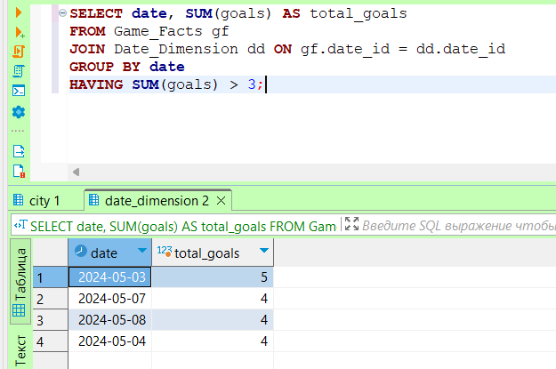
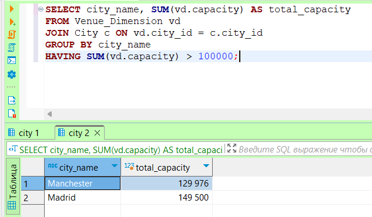

# Лаб.работа №9 

### Запросы к базе Футбол

#### Distinct

1 Получение уникальных имен менеджеров:

2 Получение уникальных городов, где проводились игры:

3 Получение уникальных дат, когда проводились игры:

4 Получение уникальных названий стадионов:

5 Получение уникальных позиций игроков:

6 Получение городов, в которых проводилось более чем 1 игра:

7 Получение городов, в которых вместимость стадионов больше 50,000:

8 Получение менеджеров, команды которых забили более 5 голов

9 Получение дат, когда было забито более 3 голов за день:

10 Получение городов, в которых общее количество зрителей превысило 100,000:

11 Группировка игр по годам и подсчет количества игр в каждом году:

12 Группировка игр по командам и подсчет общего числа забитых голов:

13 Группировка игроков по национальности и подсчет количества игроков каждой национальности:

14 Группировка стадионов по городам и подсчет количества стадионов в каждом городе:

15 группировка игр по дням недели и подсчет количества игр в каждый день недели:

