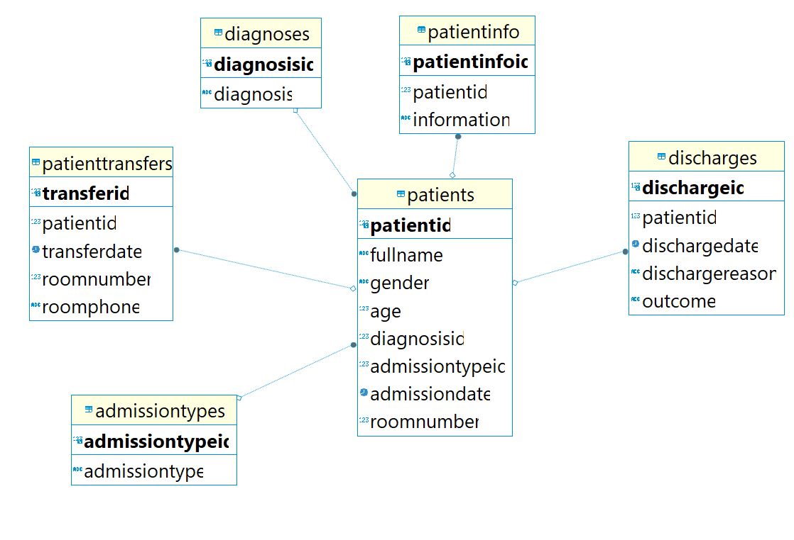

## Клиническая больница Вариант 15


## Спроектированная база 



Отношения между таблицами 

(One-to-Many)

Между таблицами Patients и PatientTransfers, так как один пациент может иметь несколько записей о переводах.

Между таблицами Patients и Discharges, так как один пациент может иметь несколько записей о выписках.

Между таблицами Patients и Diagnoses так как один пациент может иметь несколько диагнозов.

Между таблицами Patients и PatientInfo так как один пациент может иметь несколько диагнозов и соответственно несколько описаний состояния пациента.

Между таблицами Patients и AdmissionTypes так как один пациент может иметь несколько визитов в больницу.

## Запросы 

1. 

Найти всех пациентов мужского пола, старше 50 лет, которые были приняты с диагнозом "Грипп", и вывести полное имя пациента, дату госпитализации и номер палаты.

```
π_Patients.FullName, Patients.AdmissionDate, Patients.RoomNumber( σ_Patients.Gender='Male'  Patients.Age > 50  Diagnoses.Diagnosis='Грипп'( Patients ⋈ Diagnoses ) )
```

``` sql 
SELECT Patients.FullName, Patients.AdmissionDate, Patients.RoomNumber
FROM Patients
JOIN Diagnoses ON Patients.DiagnosisId = Diagnoses.DiagnosisId
WHERE Patients.Gender = 'Male' AND Patients.Age > 50 AND Diagnoses.Diagnosis = 'Грипп';
``` 


2. 
Найти средний возраст пациентов, которые были госпитализированы с диагнозом "Инфаркт", и количество таких пациентов.


```
π_AVG(Patients.Age), COUNT(*)( σ_Diagnoses.Diagnosis='Инфаркт'( Patients ⋈ Diagnoses ) )
```

``` sql
SELECT AVG(Patients.Age) AS AverageAge, COUNT(*) AS NumberOfPatients
FROM Patients
JOIN Diagnoses ON Patients.DiagnosisId = Diagnoses.DiagnosisId
WHERE Diagnoses.Diagnosis = 'Инфаркт';
```

3. Запрос выбирает все данные о пациентах, которые были переведены в другое место (отделение, клинику и т. д.) в указанную дату '2023-02-02'.

```
π_Patients.*( Patients ⋈_Patients.PatientId = PatientTransfers.PatientId  PatientTransfers.transferdate = '2023-02-02' PatientTransfers )
```

``` sql
SELECT Patients.*
FROM Patients
JOIN PatientTransfers ON Patients.PatientId = PatientTransfers.PatientId
where PatientTransfers.transferdate = '2023-02-02';
```


4. Найти все диагнозы, которые встречаются у пациентов, принятых в палату с номером 101.


```
π_Diagnoses.Diagnosis( σ_Patients.RoomNumber = 101( Patients ⋈ Diagnoses ) )
```

```sql
SELECT DISTINCT Diagnoses.Diagnosis
FROM Patients
JOIN Diagnoses ON Patients.DiagnosisId = Diagnoses.DiagnosisId
WHERE Patients.RoomNumber = 101;
```


5. Найти даты госпитализации пациентов с диагнозом "Диабет", которые были переведены хотя бы дважды.

``` 

π AdmissionDate (σ Diagnosis= ′Диабет′(Patients ⋈ Patients.PatientId=PatientTransfers.PatientId γ PatientId,count(TransferId) (PatientTransfers) ⋈ PatientTransfers.PatientId=Patients.PatientId PatientTransfers))
```

```sql

SELECT DISTINCT Patients.AdmissionDate
FROM Patients
JOIN Diagnoses ON Patients.DiagnosisId = Diagnoses.DiagnosisId
JOIN (
    SELECT PatientId, COUNT(TransferId) as TransferCount
    FROM PatientTransfers
    GROUP BY PatientId
    HAVING TransferCount >= 2
) AS TransferCounts ON Patients.PatientId = TransferCounts.PatientId
WHERE Diagnoses.Diagnosis = 'Диабет';
```
